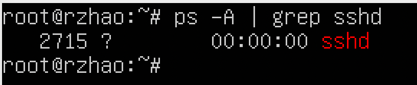
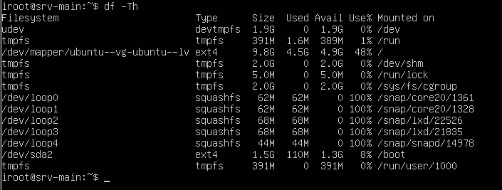

## Part 1. Installation of the OS.

Install Ubuntu 20.04 Server LTS without GUI. (Use VirtualBox)

    
Import ubuntu 20.04.3 LTS operating system from Users/shared/vbox_ubuntu.ova

  
    

> `cat /etc/issue`  

    

  

## Part 2. Creating a user.

<i>Create a user other than the one created during installation.  The user must have permission to read logs from the /var/log folder.</i>
 

  > `sudo useradd -m -G adm -s /bin/bash rzhao`  

  > `cat /etc/passwd | grep rzhao`  

  > `ls /home/`  

  > `sudo passwd rzhao`  

    

  > `login: rzhao`

    
  

## Part 3. Setting up the OS network.

***Set the machine name as user-1.*** 
  For convenience, I change a user with rights root and set computer name to <b>user-1</b>

  > `sudo usermod -o -u 0 -G 0 -s /bin/bash rzhao`  

  > `sudo hostnamectl set-hostname user-1`  

    

***Set the time zone corresponding to your current location.***
Option 1

  Commands timedatectl

  > `timedatectl list-timezones | grep Novosibirsk`

  > `timedatectl set-timezone Asia/Novosibirsk`

   

Option 2
   
  Commands /etc/localtime

   > `sudo unlink /etc/localtime`

   > `sudo ln -s /usr/share/zoneinfo/Asia/Novosibirsk /etc/localtime`
  
    

***Output the names of the network interfaces using a console command.***
  
The loopback (lo=127.0.0.1) device is a special, virtual network interface that your computer uses to communicate with itself.  It is used mainly for diagnostics and troubleshooting, and to connect to servers running on the local machine.
  
    

***Use the console command to get the ip address of the device you are working on from the DHCP server.***

The Dynamic Host Configuration Protocol (DHCP)  
is a network management protocol used on Internet Protocol (IP) networks for automatically assigning IP addresses  
and other communication parameters to devices connected to the network using a client–server architecture.

> `sudo ip link set enp0s3 down`

> `sudo ifconfig enp0s3`

> `cat /etc/netplan/00-installer-config.yaml`

> `sudo ip link set enp0s3 up`

  

***Define and display the external ip address of the gateway (ip) and the internal IP address of the gateway, aka default ip address (gw).***

Gateway ip default = 10.0.2.2

Internal addresses in range = 10.0.2.0/24

Ip adress PC = 10.0.2.15

> `route -n`

or

> `ip route`

  

***Set static (manually set, not received from DHCP server) ip, gw, dns settings (use public DNS servers, e.g. 1.1.1.1 or 8.8.8.8).***

Opening and editing /etc/netplan/00-installer-config.yaml

> `vi /etc/netplan/00-installer-config.yaml`

  

Ask addresses, gateway, dns and dhcp

  

Save, reboot and check.

  

Reboot virtual PC.

> `reboot`

  

Ping to 1.1.1.1, 8.8.8.8, mail.ru.

> `ping -c 5 1.1.1.1`

  

## Part 4. OS Update.

***Launch update OS.***

> `sudo apt apdate`

> `apt list --apgradable`

  

***Launch upgrade OS and packages.***

> `sudo apt upgrade`

 
  

***Cheked update OS.***

> `sudo apt update`

  

## Part 5. Using the sudo Commands.
  

***SUDO*** is a program for Unix-like computer operating systems that enables users to run programs with the security privileges of another user, 
by default the superuser. It stands for "superuser do", as originally that is all it did, and it is its most common usage; however, 
a common false etymology is "substitute user, do", because sudo can run a command as other users as well. 

Command use ***sudo*** and set hostname

> `sudo hostnamectl set-hostname rzhao`

  

Package version ***sudo***

> `apt list sudo`

  

## Part 6. Installing and configuring the time service.
  

> `timedatectl status`

  

## Part 7. Installing and using text editors.
  

***Install VIM text editor (+ any two others if you like NANO, MCEDIT, JOE etc.)***

> `sudo apt install vim`

> `sudo apt install nano`

> `sudo apt install joe`

  

* Add screenshots to the report:
  
Of each editor with the contents of the file before closing.

* Write down in the report what you have done to exit with the changes saved.

1. To opem with ***vim:***

> `vim test_vim.txt`

* Exit vim with save:

> `:wq`

  

2. To open with ***nano:***

> `nano test_nano.txt`

* Exit nano with save:

> `Ctrl + X`

> `Y`

> `Enter`

  

3. To open with ***joe:***

> `joe test_joe.txt`

* Exit joe with save:

> `Ctrl + K + X`

  

***Using each of the three selected editors, open the file for editing, edit the file by replacing the nickname with the "21 School 21" string, close the file without saving the changes.***

* Add screenshots to the report:

  Of each editor with the contents of the file after editing.

* Write down in the report what you have done to exit without saving the changes.

> `vim test_vim.txt`

> `:q!`

  

> `nano test_nano.txt`

> `Ctrl + X`

> `N`

  

> `joe test_joe.txt`

>`Ctrl + K + Q`

> `N`

  

All cat files:

  

***Using each of the three selected editors, edit the file again (similar to the previous point)  and then master the functions of searching through the contents of a file (a word)  and replacing a word with any other one.***

Add screenshots to the report:

* Of each editor with word search results.

* Of each editor with commands entered to replace a word with another.

Vim search:

> `/School`

  

Vim replace:

> `:%s/School/University/g`

  

Nano search:

> `Ctrl + \`

> `Ctrl + R`

  

Nano replace:

> `Ctrl + \`

> `Search text`

> `Replace text`

> `Enter`

 
  

Joe search:

> `Ctrl + K + F`

> `b` or `bi`

> `Enter`

  

Joe replace:

> `Ctrl + K + F`

> `r` or `ri`

> `Replace text`

> `Enter`

  
  
  
  

## Part 8. Installing and basic setup of the SSHD service.

***Install the SSHd service.***

> `sudo apt update`

> `sudo apt-get install ssh`

> `sudo apt install openssh-server`

  
  

***Add an auto-start of the service whenever the system boots.***

> `sudo systemctl enable ssh`

> `systemctl status ssh`

  
  

***Reset the SSHd service to port 2022.***

> `sudo vim /etc/ssh/sshd_config`

> `sudo systenctl restart sshd`

  
  
  

***PS*** is a command that lists the running processes of the operating system.

flag ***-A*** lists all processes.

***grep*** command and pattern ***sshd***, allow you to filter out all patterns and display only those that match the pattern.

  

***Output netstat***

***netstat -tan Shows all TCP connections with no DNS resolution (show IP addresses instead).***

Netstat provides statistics for the following:

* Proto – The name of the protocol (TCP or UDP).
  
* Local Address – The IP address of the local computer and the port number being used. The name of the local computer that corresponds to the 

* IP address and the name of the port is shown unless the -n parameter is specified. An asterisk (*) is shown for the host if the server is listening on all interfaces. If the port is not yet established, the port number is shown as an asterisk.

* Foreign Address – The IP address and port number of the remote computer to which the socket is connected. The names that corresponds to the IP address and the port are shown unless the -n parameter is specified. If the port is not yet established, the port number is shown as an asterisk (*).
  
* State – Indicates the state of a TCP connection. The possible states are as follows: CLOSE_WAIT, CLOSED, ESTABLISHED, FIN_WAIT_1, FIN_WAIT_2, LAST_ACK, LISTEN, SYN_RECEIVED, SYN_SEND, and TIME_WAIT. For more information about the states of a TCP connection, see RFC 793.

> `netstat -tan`

* t - Display only TCP connections.

* a - Displays all active connections and the TCP and UDP ports on which the computer is listening.

* n - Displays active TCP connections, however, addresses and port numbers are expressed numerically and no attempt is made to determine names.

* 0.0.0.0 - used to keep track of connections on all IP addresses assigned by that address's interface

  

## Part 9. Installing and using the top, htop utilities.

1. From the output of the top command determine and write in the report:  
* uptime: 5 min;
* number of authorised users: 1;
* total system load: 0.04, 0.03, 0,00 (1min, 5min, 15 min); 
* total number of processes: 108;
* cpu load: 0.0 us, 0.2 sy, 0.0 ni, 99.8 id, 0.0 wa, 0.0 hi 0.0 si 0.0 st;
* memory load: 976.0 total, 312.5 free, 202.5 used, 461.6 buff/cache;
* pid of the process with the highest memory usage: 674
* pid of the process taking the most CPU time: 899

Sort by memory
> `Shift + M`

Sort by CPU
> `Shift + P`

  

2. Add a screenshot of the htop command output to the report:
* sorted by PID, PERCENT_CPU, PERSENT_MEM, TIME
* filtered for sshd process
* with the syslog process found by searching
* with hostname, clock and uptime output added

> `sort by ***PID***`

  

> `sort by ***PERCENT_CPU***`

  

> `sort by ***PERSENT_MEM***`

  

> `sort by ***TIME***`

  

> `filtered for sshd process`

  

> `search syslog`

  

> `with hostname, clock and uptime output added`

  

## Part 10. Using the fdisk utility.

  

## Part 11. Using the df utility.

***In the report write for the root partition***

  

* Unit in the report: 1 Kb

***Run the df -Th command.***

  

* The file system type: ext4

## Part 12. Using the du utility.

> `sudo du`

  

> `sudo du -scmh /var/log /var /home`

  

> `sudo du -ch /var/log`

  

## Part 13. Installing and using the ncdu utility.

  

  

  

  

## Part 14. Working with system logs.

  

  

  

## Part 15. Using the CRON job scheduler.

> `crontab -e`

  

> `cat /var/log/syslog | grep uptime`

  

> `crontab -r`

  

