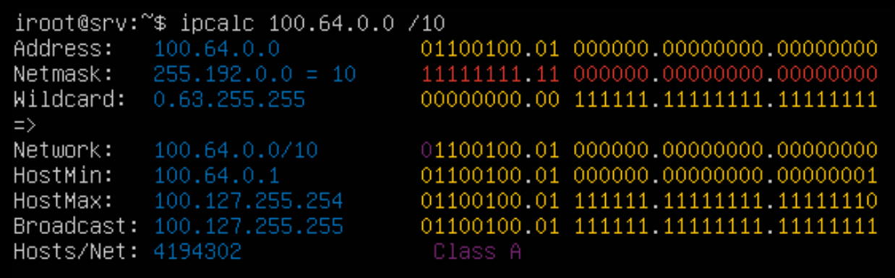
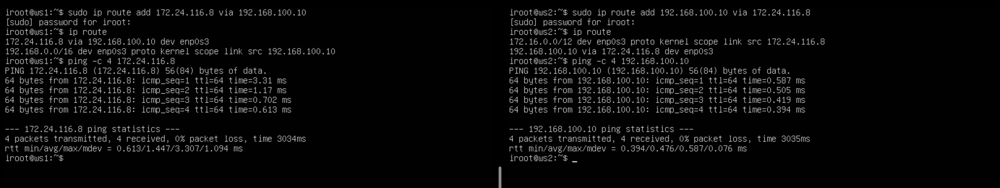
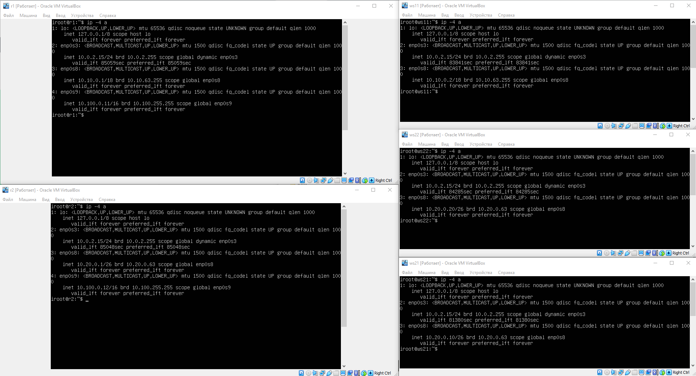
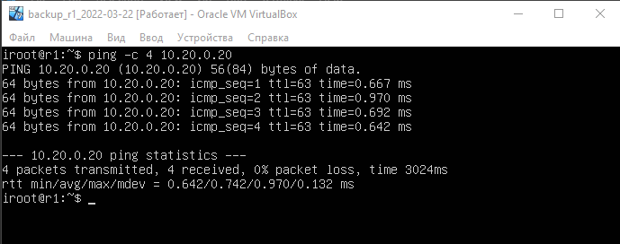

# Сети в Linux

__Оглавление:__

- [Part 1. Инструмент ipcalc](#part-1-инструмент-ipcalc)
    - [1.1. Сети и маски](#11-сети-и-маски)
    - [1.2. localhost](#12-localhost)
    - [1.3. Диапазоны и сегменты сетей](#13-диапазоны-и-сегменты-сетей)
- [Part 2. Статическая маршрутизация между двумя машинами](#part-2-статическая-маршрутизация-между-двумя-машинами)
    - [2.1. Добавление статического маршрута вручную](#21-добавление-статического-маршрута-вручную)
    - [2.2. Добавление статического маршрута с сохранением](#22-добавление-статического-маршрута-с-сохранением)
- [Part 3. Утилита iperf3](#part-3-утилита-iperf3)
    - [3.1. Скорость соединения](#31-скорость-соединения)
    - [3.2. Утилита iperf3](#32-утилита-iperf3)
- [Part 4. Сетевой экран](#part-4-сетевой-экран)
    - [4.1. Утилита iptables](#41-создание-добавление-правил-и-запуск-firewall)
    - [4.2. Утилита nmap](#42-утилита-nmap)
- [Part 5. Статическая маршрутизация сети](#part-5-статическая-маршрутизация-сети)
    - [5.1. Настройка адресов машин](#51-настройка-адресов-машин)
    - [5.2. Включение переадресации IP-адресов](#52-включение-переадресации-ip-адресов)
    - [5.3. Установка маршрута по-умолчанию](#53-установка-маршрута-по-умолчанию)
    - [5.4. Добавление статических маршрутов](#54-добавление-статических-маршрутов)
    - [5.5. Построение списка маршрутизаторов](#55-построение-списка-маршрутизаторов)
    - [5.6. Использование протокола ICMP при маршрутизаци](#56-использование-протокола-icmp-при-маршрутизации)
- [Part 6. Динамическая настройка IP с помощью DHCP](#part-6-динамическая-настройка-ip-с-помощью-dhcp)
- [Part 7. NAT](#part-7-nat)
- [Part 8. Знакомство с SSH Tunnels.](#part-8-знакомство-с-ssh-tunnels)

## Part 1. Инструмент ipcalc

### 1.1. Сети и маски

#### 1.1.1 Адрес сети 192.167.38.54/13

> `ipcalc -c 192.167.38.54/13`  
> Адрес сети: **192.160.0.0**

#### 1.1.2 Перевод маски 255.255.255.0 в префиксную и двоичную запись, /15 в обычную и двоичную, 11111111.11111111.11111111.11110000 в обычную и префиксную

> `ipcalc 192.167.38.54 255.255.255.0`  
> Префиксная запись: **/24**  
> Двоичная запись: **11111111.11111111.11111111.00000000**

> `ipcalc 192.167.38.54 /15`  
> Обычная запись: **255.254.0.0**  
> Двоичная запись: **11111111.11111110.00000000.00000000**

> `ipcalc 192.167.38.54 /28 - 11111111.11111111.11111111.11110000`  
> Обычная запись: **255.255.255.240**  
> Префиксная запись: **/28**

#### 1.1.3 Минимальный и максимальный хост в сети 12.167.38.4 при масках; /8, 11111111.11111111.00000000.00000000, 255.255.254.0 и /4

> `ipcalc 12.167.38.4 /8`  
> Минимальный host: **12.0.0.1**  
> Максимальный host: **12.255.255.254**

> `ipcalc 12.167.38.4 /16 - 11111111.11111111.00000000.00000000`  
> Минимальный host: **12.167.0.1**  
> Максимальный host: **12.167.255.254**

> `ipcalc 12.167.38.4 255.255.2554.0`  
> Минимальный host: **12.167.38.1**  
> Максимальный host: **12.167.39.254**

> `ipcalc 12.167.38.4 /4`  
> Минимальный host: **0.0.0.1**  
> Максимальный host: **15.255.255.254**

### 1.2. localhost
#### Определить и записать в отчёт, можно ли обратиться к приложению, работающему на localhost, со следующими IP: 194.34.23.100/16, 127.0.0.2/24, 127.1.0.1/8, 128.0.0.1/8

**localhost** (так называемый, «местный» от англ. local, или «локальный хост», по смыслу — этот компьютер) — в компьютерных сетях, стандартное, официально зарезервированное доменное имя для частных IP-адресов (в диапазоне 127.0.0.1 — 127.255.255.254, RFC 2606). Для сети, состоящей только из одного компьютера, как правило, используется всего один адрес — 127.0.0.1, который устанавливается на специальный сетевой интерфейс «внутренней петли» (англ. loopback) в сетевом протоколе TCP/IP.

> `Если приложение будет работать на localhost с IP адресами 127.0.0.2/24 и 127.1.0.1/8, то можно обратиться;`  
> `Если приложение будет работать на localhost с IP адресами 194.34.23.100/16 и 128.0.0.1/8, то нельзя обратиться.`

### 1.3. Диапазоны и сегменты сетей

#### 1.3.1 Какие из перечисленных IP можно использовать в качестве публичного, а какие только в качестве частных: 
10.0.0.45/8, 
134.43.0.2/16, 
192.168.4.2/16, 
172.20.250.4/12, 
172.0.2.1/12, 
192.172.0.1/12, 
172.68.0.2/12, 
172.16.255.255/12, 
10.10.10.10/8, 
192.169.168.1/16

**Частные диапазоны IP-адресов:**  
* **10.0.0.0/8** (10.0.0.0 — 10.255.255.255) - Почти 17 млн. IP-адресов, которые можно использовать в своей локальной сети. Никаких особых рекомендаций для этой подсети нет;  
* **100.64.0.0/10** (100.64.0.0 — 100.127.255.255) - Сеть на 4.194 млн. адресов, RFC 6598 рекомендует использовать эту сеть провайдерам, которые выпускают нас в Интернет. Если вы получаете от провайдера серый IP-адрес, то, скорее всего, он будет в этом диапазоне;  
* **172.16.0.0/12** (172.16.0.0 — 172.31.255.255) - Немногим больше 1 млн. IP-адресов. Никаких особых рекомендаций для этой подсети нет;  
* **192.168.0.0/16** (192.168.0.0 — 192.168.255.255) - Частная подсеть на 65 534 IP-адреса, без особых рекомендаций.

**==Частные IP:==**

* 10.0.0.45/8  
* 192.168.4.2/16  
* 172.20.250.4/12  
* 172.16.255.255/12  
* 10.10.10.10/8

**==Публичные IP:==**

* 134.43.0.2/16  
* 172.0.2.1/12  
* 192.172.0.1/12  
* 172.68.0.2/12  
* 192.169.168.1/16

#### 1.3.2 Какие из перечисленных IP адресов шлюза возможны у сети 10.10.0.0/18: 
10.0.0.1, 
10.10.0.2, 
10.10.10.10, 
10.10.100.1, 
10.10.1.255

**==IP для шлюза входящие в сеть:==**

* 10.10.0.2  
* 10.10.10.10  
* 10.10.1.255

**==IP для шлюза НЕ входящие в сеть:==**

* 10.0.0.1  
* 10.10.100.1

## Part 2. Статическая маршрутизация между двумя машинами

### Скрин с помощью команды **`ip a`**  на ws1 и ws2
> ip a

### Прописываем статичесике адреса
> sudo vim /etc/netplan/00-installer-config.yaml

### Перезапускаем сервис netplan
> sudo netplan apply

### 2.1. Добавление статического маршрута вручную
> **`ws1`**  
> sudo ip route add 172.24.116.8 via 192.168.100.10

> **`ws2`**  
> sudo ip route add 192.168.100.10 via 172.24.116.8

### 2.2. Добавление статического маршрута с сохранением
> sudo vim /etc/netplan/00-installer-config.yaml

> **`ws1`**  
> ping -c 4 172.24.116.8

> **`ws2`**  
> ping -c 4 192.168.100.10

## Part 3. Утилита iperf3

### 3.1. Скорость соединения
* 8 Mbps = 1 MB/s  
* 100 MB/s = 819200 Kbps  
* 1 Gbps = 1024 Mbps

### 3.2. Утилита iperf3
Передано **2.23GBytes** cо ср. скоростью **1.92Gbits/sec**

> **`ws1`**  
> iperf3 -s

> **`ws2`**  
> iperf -c 192.168.100.10

## Part 4. Сетевой экран

### 4.1 Создание, добавление правил и запуск firewall  
#### Создание файла /etc/firewall.sh
> touch /etc/firewall.sh

#### Добавление правил в /etc/firewall.sh
> sudo vim /etc/firewall.sh

#### Запуск /etc/firewall.sh
Правила в iptables имеют приоритезацию, т.е. выполняются все попорядку сверху вниз. Таким образом, пакеты icmp на ws1 сначало попадут в правло DROP, а потом в ACCEPT и соответственно входящий трафик по протаколу icmp пойдет дальше. А вот на ws2 все наооброт.

### 4.2. Утилита nmap

## Part 5. Статическая маршрутизация сети

Сеть:  

**`3 рабочие станции (ws11, ws21, ws22) и 2 роутера (r1, r2))`**

### 5.1. Настройка адресов машин.
#### Настройка конфигурации машин в etc/netplan/00-installer-config.yaml согласно сети на рисунке.  
> sudo vim etc/netplan/00-installer-config.yaml

> sudo netplan apply  
> ip -4 a

#### Проверяем пинги от ws21 до ws22, а так же с ws11 до r1

### 5.2. Включение переадресации IP-адресов.

> sudo sysctl -w net.ipv4.ip_forward=1

> sudo vim /etc/sysctl.conf
> net.ipv4.ip_forward = 1

### 5.3. Установка маршрута по-умолчанию.

> sudo vim etc/netplan/00-installer-config.yaml

#### Выводим таблицу маршрутизации  
> ip r

#### Пингуем r2 c wc11 и проверяем, что пинги доходят с помощью **tcpdump**

> ping -c 2 10.100.0.12  
> tcpdump -vv icmp -n -i enp0s9

### 5.4. Добавление статических маршрутов.

#### Добаввляем в роутеры r1 и r2 статические маршруты

> ip r

> ip r list 10.10.0.0/18  
> ip r list 0.0.0.0/0

* Для сети 10.10.0.0/18 был выбран маршрут 10.10.0.2, отличный от 0.0.0.0/0, хотя он попадает под маршрут по-умолчанию, потому что мы задали более точную настройку интерфейса с адресом, сетью и шлюзом.  
Соответственно:  
`proto kernel` - означает, что роутинг был задан ядром автоматически при задании ip интерфейса;  
`scope link` - означает, что эта запись действительна только для этого интерфейса (enp0s8);  
`src 10.10.0.2` - задает ip-адрес отправителя для пакетов, попадающих под это правило роутинга.

### 5.5. Построение списка маршрутизаторов

#### Запускаем `tcpdump` на r1
> tracerout 10.20.0.10  
> sudo tcpdump -tnv -i etn0s8

* ws11 отправляет данные icmp по udp через r1 10.10.0.1 с флагом на соединение [S] каждый раз увеличивая ttl на 1, а r1 перенаправляет их на r2 10.100.0.12. Затем обратно до ws1 10.10.0.2.

### 5.6. Использование протокола **ICMP** при маршрутизации

`r1`  
> sudo tcpdump -n -i etn0s8 icmp  

`ws11`  
> ping -c 1 10.30.0.111

## Part 6. Динамическая настройка IP с помощью DHCP.

**Для r2 настраиваем в файле /etc/dhcp/dhcpd.conf конфигурацию службы DHCP:**  
Устанавливаем dhcp-сервер:  
> sudo apt install isc-dhcp-server

Настраиваем на r2 конфигурационный файл /etc/dhcp/dhcpd.conf для выдачи ip адресов на подсеть 10.20.0.0/26  
> sudo vim /etc/dhcp/dhcpd.conf

Так как мы указали в качестве dns ip самого сервера, то пропишим адрес dns в resolv.conf

Перезапускаем сервис isc-dhcp-server и проверяем, что он активен и ждет запросов на получение ip

Перезагружаем ws21 и проверям, что получили новый ip c dhcp сервера и пробуем пинговать соседнюю машину ws22 с этой подсети

#### Для r1 настраиваем аналогично r2, но делаем выдачу адресов с жесткой привязкой к MAC-адресу (ws11). Проводим аналогичные тесты.

`ws11`

`r1`

`ws11`

**Запрашиваем с ws21 обновление ip адреса**

Проверяем текущий ip  
> ip a

Освобождаем ip и получаем новый  
> sudo dhclient -r enp0s8  

Смотрим подробный режим, все сообщения DORA прошли, новый ip получили
> sudo dhclient -v enp0s8

## Part 7. NAT.

В файле /etc/apache2/ports.conf на ws22 и r2 меняем строку Listen 80 на Listen 0.0.0.0:80, то есть сделать сервер Apache2 общедоступным

Запускаем apache2 на r1, r2, ws22  
> sudo service apache2 start

Добавляем в фаервол, созданный по аналогии с фаерволом из Части 4, на r2 следующие правила:

Запускаем файл также, как в Части 4

Проверяем соединение между ws22 и r1 командой ping, пинги не идут

Добавляем в файл ещё одно правило: *Разрешить маршрутизацию всех пакетов протокола ICMP* и проверяем соединение между ws22 и r1 командой ping

#### Включаем SNAT, а именно маскирование всех локальных ip из локальной сети, находящейся за r2 (по обозначениям из Части 5 - сеть 10.20.0.0)

Проверяем соединение по TCP для SNAT, для этого с ws22 подключаемся к серверу Apache на r1 командой `telnet`;  
* ключ -t указывает на используемую таблицу, если данный ключ не указан, то по умолчанию используется таблица `filter`;  
* Запись добавляется в цепочку `POSTROUTING` и предписывает выполнить действие `SNAT` для всех пакетов, попадающих под критерий `-o enp0s9`, т.е. использующих в качестве исходящего внешний интерфейс `enp0s9`;  
* `--to-source` используется для указания адреса, присваиваемому пакету, теперь именно этот адрес будет указываться в качестве исходящего.

**Приведенное выше правило будет изменять адрес источника для всех исходящих пакетов без разбору**

#### Включаем DNAT на 8080 порт машины r2 и добавляем к веб-серверу Apache, запущенному на ws22, доступ извне сети

* DNAT применяется в основном для проброса портов  выводом  
* При отправке пакета на внешний адрес нашего роутера 10.100.0.12, адресом источника будет являться адрес узла, адресом назначения - внешний адрес роутера. Получив такой пакет брандмауэр находит нужное правило и изменяет адрес назначения пакета на внутренний адрес целевого узла, т.е. на 10.20.0.20 и отправляет его в локальную сеть.

Проверяем соединение по TCP для DNAT, для этого с r1 подключаемся к серверу Apache на ws22 командой `telnet` (обращаемся по адресу r2 и порту 8080)

## Part 8. Знакомство с SSH Tunnels.

Запускаем службу apache2 на ws22 на localhost:  
>sudo service apache2 start

Подключаемся по ssh через Local TCP forwarding с ws21 к ws22 и делаем проверку командой `telnet`:

Подключаемся по ssh через Remote TCP forwarding c ws11 до ws22 и делаем проверку командой `telnet`:

