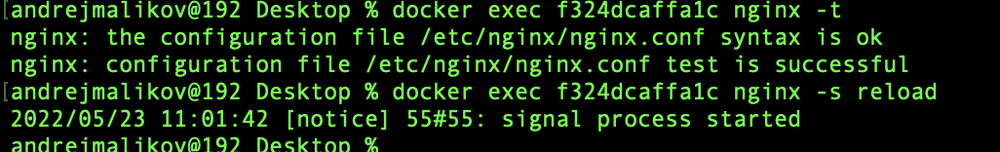

# DO5_SimpleDocker-0 (Simple Docker)

## Оглавление

- [Part 1. Готовый докер](#part-1-готовый-докер)
- [Part 2. Операции с контейнером](#part-2-операции-с-контейнером)

## Part 1. Готовый докер

### Загружаем образ nginx на локальный репозиторий с Docker HUB
> `docker pull nginx`  

  

### Смотрим список образов в локальном репозитории
> `docker images`  

  

### Запускаем контейнер из образа nginx и смотрим, что контейнер запущен в процессах
> `docker run -d nginx`  
> `docker ps` 

  

### Получаем информацию о контейнере
> `docker container inspect -s ecee44cc8c65 | grep Size`  
> `docker container inspect -f {{.Config.ExposedPorts}} ecee44cc8c65`  
> `docker container inspect -f {{.NetworkSettings.IPAddress}} ecee44cc8c65`  

  

### Останавливаем контейнер nginx и проверяем, что процесс остановился
> `docker stop ecee44cc8c65`  
> `docker ps`  

  

### Запускаем докер с замапленными портами **80** и **443** на локальную машину
> `docker run -d -p 80:80 -p 443:443 nginx`  
> `docker ps`  

  

### Проверяем работу сервера nginx по адресу **localhost:80**

  

### Перезапускаем контейнер и проверяем, что контейнер запустился
> `docker restart f324dcaffa1c`  
> `docker ps`  

 

## Part 2. Операции с контейнером

### Читаем конфигурационный файл **nginx.conf** внутри докер образа
> `docker exec f324dcaffa1c cat /etc/nginx/nginx.conf`  

 

### Создаем файл **nginx.conf** на локальной машине
> `touch nginx.conf`   

 

### Настраиваем в нем путь **/status** на отдачу страницы статуса сервера **nginx** и копируем файл в контейнер
> `docker cp nginx.conf f324dcaffa1c:/etc/nginx/`   

  
  

### Проверяем корректность файла и перезапускаем **nginx** внутри докер образа
> `docker exec f324dcaffa1c nginx -t`  
> `docker exec f324dcaffa1c nginx -s reload`  

### Проверяем адрес **localhost:80/status**

### Экспортируем контейнер в файл **container.tar**
> `docker export e336d9a0969c > container.tar`  

### Останавливаем контейнер и удаляем образ  **nginx** 
> `docker stop e336d9a0969c > container.tar`  

###  Удаляем образ **nginx** 
> `docker rmi -f nginx`

### Импортируем контейнер обратно и проверяе запущенный процесс
> `docker stop e336d9a0969c > container.tar`  

